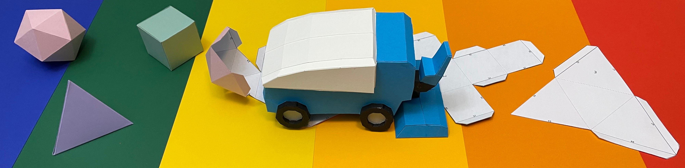
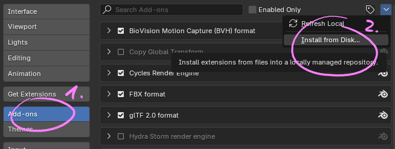
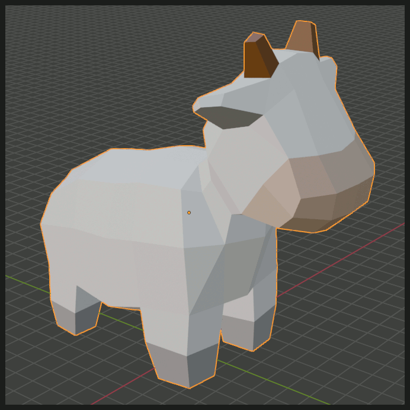
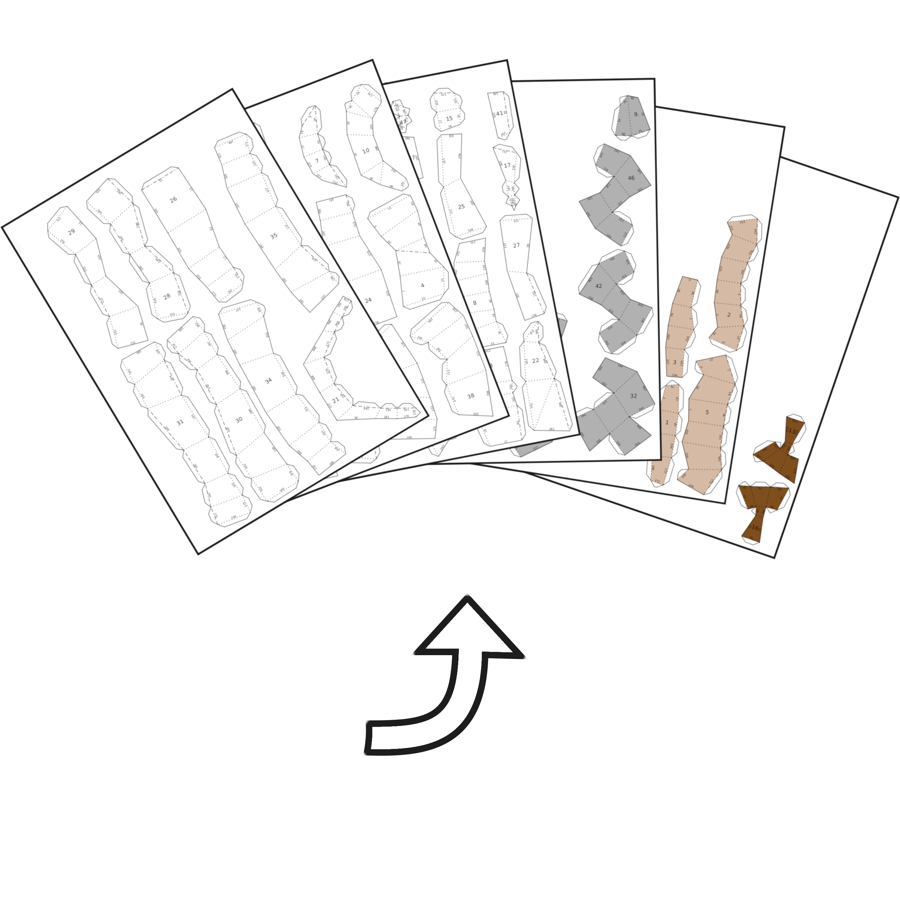

# PolyZamboni - Papercraft in Blender



Turn your low-poly creations into papercraft instructions with this Blender addon. You no longer need any additional software or good faith in some automatic unfolding algorithm. PolyZamboni provides you with all tools necessary to create high quality paper models!  

## Addon installation
To add polyzamboni to Blender, clone this repository and zip the `PolyZamboni` folder containing this readme file and the `__init__.py` file. Then go into Blender and go to **Edit-><ins>P</ins>references**. On the top left of the **Add-ons** tab, you can now click on **<ins>I</ins>nstall from Disk** and select the zipped `PolyZamboni` folder. If all [required python packages](#requirements) are installed, the addon should now be enabled and ready to go.



### PolyZamboni as a Blender Extension
If you are using Blender version 4.3, you can install polyzamboni as a Blender Extension. This comes with the benefit of all external python packages being taken care of (hopefully) automatically. You can find several builds of this addon [here](https://github.com/AntonFlorey/PolyZamboni/releases).

## Usage
With the addon enabled, select any mesh object and navigate to the PolyZamboni panel in the viewport sidebar (toggle with `'N'`) and click on the `Unfold this mesh` button. This starts the unfolding process of the selected mesh with no initial cuts.  
Not all meshes can be processed by PolyZamboni. The following things prevent this addon from working for your mesh:

1. Non-manifold vertices or edges
2. Faces that touch at more than one edge
3. Faces that can not be triangulated via PolyZambonis custom triangulation angorithm
4. Faces that are highly non-planar

You will get a warning whenever one of these fail-cases occur and the option to select all faces that need to be fixed.

### Interactive paper model editing

<p float="middle">
    
    
</p>

To transform your 3D model into printable mesh pieces that can be glued together to create an awesome paper model, you have to define where the mesh should be cut open and where to place flaps for glueing. You can edit cuts and glue flaps by pressing the `PolyZamboni Edit Mode` button. In this edit mode you have access to plenty of powerful tools:

- `Separate Materials` adds cuts between all faces that have different materials assigned to them.
- `Auto Unfold` automatically adds cuts until the entire mesh can be unfolded. The algorithm tries to create loops of connected faces. You can choose whether these loops should wrap around the `X`, `Y` or `Z` axis. You can also give a maximum number of connected faces.
- `Recompute Flaps` places glue flaps at all cut edges. The greedy algorithm tries to avoid overlaps of the printed pieces. There is also a toggle next to the button that lets you decide whether flaps should alternate along patch boundaries.
- `Alt+C` opens the manual cuts pie menu. Here you can cut, clear or glue all selected edges. Glued edges can not be cut by the `Auto Unfold` operator and have no other purpose. You can also select multiple faces and mark them as one connected region via the `Define Region` operator. This automatically cuts all edges between selected and non-selected faces.
- `Alt+X` opens the glue flaps pie menu. Here you can flip the glue flaps attached to all selected edges. 

### Intuitive feedback
PolyZamboni renders feedback on top of your models. Dotted lines on top of mesh edges indicate one of the following:
- **Red edges:** Manually added cuts
- **Green edges:** Manually glued edges (can't be automatically cut)
- **Blue edges:** Atomatically added cuts

All connected face regions, separated by cut edges, are visualized via colored patches on top of mesh faces. These regions colored based on their quality:
- **Red regions:** These regions can not be unfolded onto a piece of paper. If any of these regions exist, no paper model can be created.
- **Orange regions:** Although all faces can be unfolded, they would overlap on the plane. This makes the resulting instructions fairly unusable in practice.
- **Yellow regions:** Almost perfect regions. Only the flaps used to glue pieces together overlap on the final print.
- **Green regions:** These regions can be unfolded without any overlaps. If all regions are green, you are usually good to go!

Glue flaps are also visualized on top of faces at the position they will have in the papercraft version of your mesh. If any flap overlaps with something in the instruction, it will be colored red. 

<p float="middle">
    
</p>

### Exporting instruction sheets 
Once you are satisfied with your edits, you can export the paper model instruction. Go to **File-><ins>E</ins>xport->Polyzamboni Export PDF/SVG** or just click in the respective buttons in the side panel. PolyZamboni lets you fully customize the instructions appearance. Here is a list of export options:
- Size of the final model. You can either specify a target model height or directly define the model scale.
- Paper size, page margin and distance between mesh pieces.
- Font sizes and colors.
- Edge appearance (width, color, linestyle, and more...)
- Texturing of mesh faces (nothing, solid color or texture image)

**Tip:** Model size and margins are measured in the units of the current blender scene. I recommend to set the scenes length unit to something like cm, unless you are planning to create huge models. Change this setting at **Scene Properties->Units**.

## And now: Get creative!
I am thrilled to see what you can create with this addon. Share your cool papercraft creations with me and the world!


## Additional features
I want to explain a couple more neat things built into this addon. These features might need some more work in the future as they are not as flexible and intuitive as the rest.

**Construction order generation:** To help you construct the paper model, build step numbers can be printed on each piece. To generate an order in which to put all pieces together, select any start face and press the `Compute Build Order` button. This will number all connected regions via a bfs search on the cut-graph. I will maybe add a way to interactively edit this numbering and see the build process step by step.

**Face texturing:** If your mesh has materials assigned to faces, you can transfer them to the paper model instructions. So far, only solid colors or single texture images are supported. PolyZamboni automatically searches for `Principled BSDF` shader nodes to get the base color of a material. A texture image is taken from an `Image Texture` shader node. Multiple textures are not supported (you would get a single random texture in such a case). Feel free to adjust the code to make this feature more powerful. I have little to no experience with texturing in blender and this is the best I could come up with.


## Requirements
This addon uses some external packages not included in the Python installation that comes with Blender. All required packages (without dependencies) are listed in `requirements.txt`.

### Here is one way of installing these packages via pip:
Open your preferred command shell and navigate to the Python binary folder of your Blender installation.  

```bash
cd 'some_path_prefix\Blender Foundation\Blender 4.3\4.3\python\bin'
```
For reference, on my Windows machine the exact path to the folder is    
`'C:\Program Files\Blender Foundation\Blender 4.3\4.3\python\bin'`.

Then install the missing packages using pip.

```bash
./python -m pip install -r "some_path_prefix\PolyZamboni\requirements.txt" --target="..\lib\site-packages" --upgrade
```
Make sure to give the correct path to the requirements file by replacing `some_path_prefix` with the location of the PolyZamboni folder on your computer.

### Some notes:
- Make sure that you have permission to write and modify files in the python folder. The easiest way would be to open your shell as admin.
- This installation guide uses Windows path formats, but the same steps should also do the trick on Linux and macOS systems (not tested yet).